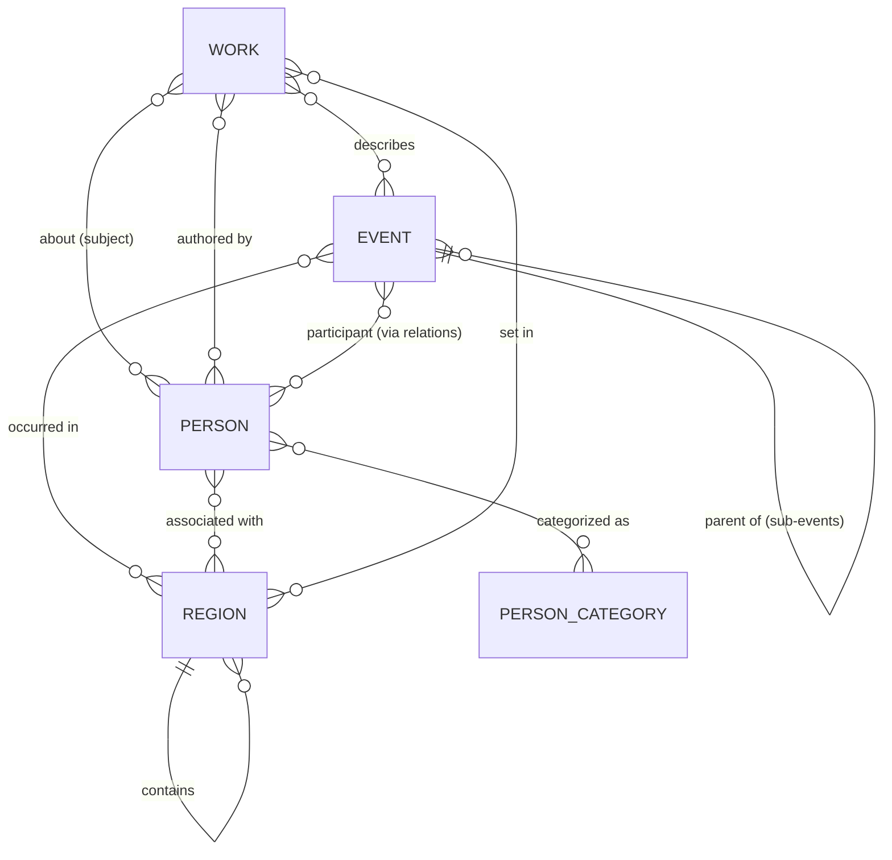

# 03 — Domain model

## Entity overview



Three **timeline entities** appear on the axis — `Event`, `Person`, `Work` — plus two **taxonomy entities** used for filtering and styling — `PersonCategory`, `Region` — and a generic **relation** edge list for everything the embedded foreign keys don't cover.

## The date model

Historical dates have variable precision and open ends. Dates are authored as strings and compiled to numbers for layout.

```ts
/** Authored form: "1948" | "1948-05" | "1948-05-14" */
type HistDate = string;

interface DateRange {
  start: HistDate;
  end?: HistDate | null;   // omitted → point-in-time; null → open/ongoing (e.g. person alive)
  approx?: boolean;        // circa — rendered with a ≈ affordance
}
```

- Internally every `HistDate` converts to a **decimal year** (`1948-05-14` → `1948.37`) via `domain/dates.ts`. All layout, zoom, and culling math uses decimal years; nothing downstream parses strings.
- Precision is preserved for display (a year-only date renders as "1948", never a fabricated "1 בינואר 1948").
- The model is Gregorian; Hebrew-calendar display is a future formatting concern, not a storage concern.

## Entities (authoritative shapes)

Zod schemas in `src/domain/entities.ts` are the single source of truth; TypeScript types derive from them and the content validator uses them. Shapes shown as TS for readability:

```ts
type EntityId = string;          // kebab-case slug, unique across all types, e.g. "war-of-independence"
interface Text { he: string }    // language-keyed from day one; adding { en?: string } later is additive

interface EventEntity {
  id: EntityId;
  type: 'event';
  title: Text;
  description: Text;             // short — 1–3 sentences
  dates: DateRange;
  parentId?: EntityId;           // sub-event → parent event; arbitrary depth allowed, MVP populates ≤2 levels
  importance: number;            // 1–100, see docs/05
  regionIds: EntityId[];
  tags?: string[];
  image?: { src: string; alt: Text; credit?: string };
  links?: { label: Text; url: string }[];
}

interface PersonEntity {
  id: EntityId;
  type: 'person';
  name: Text;
  bio: Text;                     // short biography
  lifespan: Lifespan;            // like DateRange but `end` is REQUIRED: a death
                                 // date, or null while alive — an omitted end
                                 // would silently mean a 1-year "point" life
  categoryIds: EntityId[];       // → PersonCategory
  importance: number;
  regionIds: EntityId[];
  image?: Image;
  links?: Link[];
}

// Work types are an OPEN taxonomy (content/taxonomies/work-types.json):
// biography | autobiography | historical-novel today; adding one is a content
// change, validated at build time — not a code enum.
type WorkType = EntityId;

interface WorkEntity {
  id: EntityId;
  type: 'work';
  workType: WorkType;
  title: Text;
  description: Text;
  authorPersonIds?: EntityId[];  // when the author is themselves a timeline person
  authorName?: Text;             // when not
  subjectPersonIds?: EntityId[]; // who the book is about (autobiography: same as author)
  subjectEventIds?: EntityId[];
  publicationDate: HistDate;     // stored, NOT used for MVP positioning (decision D7)
  coveredPeriod: DateRange;      // ← timeline position derives from this
  importance: number;
  regionIds: EntityId[];
  image?: Image;                 // cover
  links?: Link[];                // source / purchase / catalog
}

interface Category {            // one shape for person AND event categories
  id: EntityId;                  // e.g. מנהיגים, סופרים | מלחמות וביטחון
  name: Text;
  color: string;                 // --cat-* design token key (existence validated at build)
  description?: Text;
}
// Taxonomy files: person-categories.json, event-categories.json,
// work-types.json (same shape as Category), regions.json.

interface Region {
  id: EntityId;
  name: Text;
  kind: 'continent' | 'country' | 'district' | 'region' | 'city' | 'settlement' | 'area' | 'site';
  parentId?: EntityId;          // hierarchy: israel > jerusalem; filtering by a parent includes descendants
}

/** Generic typed edges for everything not covered by embedded FKs above.
    Stored, validated, and exposed in the dataset — but no explorer UI in MVP. */
interface Relation {
  from: EntityId;
  to: EntityId;
  type: 'participated-in' | 'led' | 'influenced' | 'related-to';
  note?: Text;
}
```

## Relationship strategy

Two mechanisms, deliberately:

1. **Embedded foreign keys** for the relationships the MVP actually renders — `work.subjectPersonIds`, `work.authorPersonIds`, `event.parentId`, `*.regionIds`, `person.categoryIds`. Simple to author, cheap to resolve, and the detail panel can already show "ספרים על אישיות זו" by reverse lookup.
2. **The `Relation` edge list** for open-ended connections (person participated in event, event influenced event). This is the growth path to a relationship explorer without schema migration. MVP validates and loads it; UI ignores it.

The content build resolves and verifies every reference (no dangling IDs reach the app) and precomputes reverse indexes (person → works about them) into the compiled dataset.

## Extensibility notes

- **New content types** (e.g. photographs, newspapers, testimonies): add a new entity schema + a normalization rule to `TimelineItem` ([06](06-timeline-rendering.md)); filters pick it up via `contentType`.
- **New regions/periods**: pure content addition; nothing in the model references 1930–2000 or Israel.
- **New person categories / event tags**: taxonomy file additions.
- **Multilingual**: widen `Text` to `{ he: string; en?: string }` — additive.
