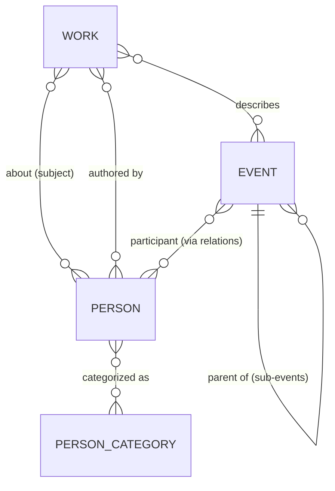

# Domain model

## Entity overview



Three **timeline entities** — `Event`, `Person`, `Work` — plus the **taxonomy
entities** used for filtering and styling — `Category` (person & event),
`WorkType` — and a generic **relation** edge list for everything the embedded
foreign keys don't cover.

## The date model

Historical dates have variable precision and open ends. Dates are authored as
strings and compiled to numbers for layout.

```ts
/** Authored form: "1948" | "1948-05" | "1948-05-14" */
type HistDate = string;

interface DateRange {
  start: HistDate;
  end?: HistDate | null;   // omitted → point-in-time; null → open/ongoing (e.g. person alive)
  approx?: boolean;        // circa — rendered with a ≈ affordance
}
```

- Internally every `HistDate` converts to a **decimal year** (`1948-05-14` → `1948.37`) via `domain/dates.ts`. All layout, zoom, and culling math uses decimal years; nothing downstream parses strings.
- Precision is preserved for display (a year-only date renders as "1948", never a fabricated "1 בינואר 1948").
- The model is Gregorian; Hebrew-calendar display is a future formatting concern, not a storage concern.

## Entities (authoritative shapes)

Zod schemas in `src/domain/entities.ts` are the single source of truth;
TypeScript types derive from them and the content validator uses them. Shapes
shown as TS for readability:

```ts
type EntityId = string;          // kebab-case slug, unique across all types, e.g. "war-of-independence"
interface Text { he: string }    // language-keyed from day one; adding { en?: string } later is additive

interface EventEntity {
  id: EntityId;
  type: 'event';
  title: Text;
  description: Text;             // short — 1–3 sentences
  dates: DateRange;
  parentId?: EntityId;           // sub-event → parent event; arbitrary depth allowed, MVP populates ≤2 levels
  importance: number;            // 1–100, see zoom.md
  tags?: string[];
  image?: { src: string; alt: Text; credit?: string };
  video?: { provider: 'youtube'; videoId: string; title: Text; credit?: string }; // rare — real footage only (D19)
  sources?: Source[];                        // cited references (title + url); validator requires ≥1
}

interface PersonEntity {
  id: EntityId;
  type: 'person';
  name: Text;
  bio: Text;                     // short biography
  lifespan: Lifespan;            // like DateRange but `end` is REQUIRED: a death
                                 // date, or null while alive — an omitted end
                                 // would silently mean a 1-year "point" life
  categoryIds: EntityId[];       // → PersonCategory
  importance: number;
  image?: Image;
  sources?: Source[];            // ≥1 required (validator)
}

// Work types are an OPEN taxonomy (content/taxonomies/work-types.json):
// biography | autobiography | historical-novel today; adding one is a content
// change, validated at build time — not a code enum.
type WorkType = EntityId;

interface WorkEntity {
  id: EntityId;
  type: 'work';
  workType: WorkType;
  title: Text;
  description: Text;
  authorPersonIds?: EntityId[];  // when the author is themselves a timeline person
  authorName?: Text;             // when not
  subjectPersonIds?: EntityId[]; // who the book is about (autobiography: same as author)
  subjectEventIds?: EntityId[];
  publicationDate: HistDate;     // stored, NOT used for positioning (decision D7)
  coveredPeriod: DateRange;      // ← shelf membership derives from this
  importance: number;
  image?: Image;                 // cover
  sources?: Source[];            // ≥1 required (validator)
}

// A cited reference backing an entity's facts. `url` is REQUIRED (decision
// D18) — a source with no reachable page doesn't help the reader. Sourcing
// policy lives in content.md#sourcing.
interface Source {
  title: Text;                   // the source's name (Hebrew field, may hold a Latin name)
  url: string;                   // real, stable http(s) URL — required
  publisher?: string;            // institution/publisher, when distinct from title
  kind?: 'archive' | 'library' | 'museum' | 'encyclopedia' | 'reference'
       | 'academic' | 'government' | 'book' | 'press' | 'website';
}

interface Category {            // one shape for person AND event categories
  id: EntityId;                  // e.g. מנהיגים, סופרים | מלחמות וביטחון
  name: Text;
  color: string;                 // --cat-* design token key (existence validated at build)
  description?: Text;
}
// Taxonomy files: person-categories.json, event-categories.json,
// work-types.json (same shape as Category).

/** Generic typed edges for everything not covered by embedded FKs above.
    Stored, validated, and exposed in the dataset — but no explorer UI in MVP. */
interface Relation {
  from: EntityId;
  to: EntityId;
  type: 'participated-in' | 'led' | 'influenced' | 'related-to';
  note?: Text;
}
```

## Relationship strategy

Two mechanisms, deliberately:

1. **Embedded foreign keys** for the relationships the MVP actually renders — `work.subjectPersonIds`, `work.authorPersonIds`, `event.parentId`, `person.categoryIds`. Simple to author, cheap to resolve, and the detail panel can already show "ספרים על אישיות זו" by reverse lookup.
2. **The `Relation` edge list** for open-ended connections (person participated in event, event influenced event). This is the growth path to a relationship explorer without schema migration. MVP validates and loads it; UI ignores it.

The content build resolves and verifies every reference (no dangling IDs reach
the app) and precomputes reverse indexes (person → works about them) into the
compiled dataset.

## Sourcing

Every timeline entity carries a `sources: Source[]` — one unified list of cited
references behind its facts (this folds in the old related-`links` list; decision
D18). The validator requires **≥1 source per entity**, and every `Source.url`
must be a real http(s) URL, not a placeholder — a citation with no reachable page
doesn't help the reader. The full authoring policy — prefer authoritative
institutions, preserve uncertainty, cite a page you can confirm rather than
fabricate one — is in [content.md#sourcing](content.md#sourcing). Sources render
under "מקורות וקישורים" in the detail panel. (Decisions D15, D18.)

## Media

`image` (any entity) and `video` (events only) are optional and always
external links — nothing binary lives in the repo. `video` is deliberately a
closed `provider` enum (`youtube` today) plus a bare, regex-validated
`videoId`, never a raw URL or embed HTML: the render path is the only thing
that builds the iframe src (`https://www.youtube-nocookie.com/embed/<videoId>`),
so a content file can never point an embed at an arbitrary domain (decision
D19). Authoring policy — preferred sources per media type, when to omit rather
than force a weak match — is in
[content.md#media](content.md#media).

## Extensibility notes

- **New content types** (photographs, newspapers, testimonies): add a new entity schema + a normalization rule to `TimelineItem` ([rendering](rendering.md)); filters pick it up via `contentType`.
- **New places/periods**: pure content addition; nothing in the model references 1930–2000 or Israel.
- **New person categories / event tags**: taxonomy file additions.
- **Multilingual**: widen `Text` to `{ he: string; en?: string }` — additive.
